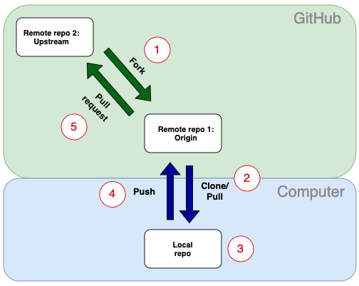

# How to Contribute

While Git can be used for personal version control, it truly shines when used
in conjunction with GitHub as a collaborative tool. The general functionality
and structure of Git reflects that it was developed so that repositories could
be edited by many people simultaneously.

## Guide for Contributors

1. **Fork** the project. This copies the project repository and history to your
   own GitHub account.

2. **Clone** the fork to your local computer (can be skipped if editing on
   Github). This copies the fork from GitHub to a directory on your computer.
   This is where you will edit the files.

       git clone https://github.com/{YourAccount}/handson-2021-version-control
       cd handson-2021-version-control

   The forked repository should be named as the "origin" remote, while the
   original project you wish to contribute to is known as the "upstream" remote.
   The "origin" remote was set automatically during clone, but you will need to
   add the "upstream" repository.

       git remote -v
       git remote add upstream https://github.com/ohbm/handson-2021-version-control

   You only need to clone when first creating the local repository. Once
   established, you can just **pull** any updates to ensure you are working
   with the most recent version.

       git pull upstream master

   It is generally good practice to create a separate branch from the "master"
   to make edits in. This allows you to continually pull updates from the master
   branch while working on your branch.

       git checkout -b {YourEdit}
       git branch -vv

   Your branch name should be informative what edits you intend to make. Running
   `git branch` shows all branches in your local repository. Currently checked
   out branch is marked with an asterisk.

3. After editing, **add** all changed files you want to submit to the staging
   area and **commit** them to the repository with a meaningful message.

       git add -A
       git commit -m "describe what your changes do"

4. **Push** the branch with your commits to your fork (origin) on Github.

       git push -u origin {YourEdit}

5. Submit a **pull request** to the upstream repository. The project maintainers
   can then review your changes and decide whether to merge your commits to the
   main repository. If your pull request is accepted, Github will notify you and
   prompt you to delete the branch with merged commits. This deletes the branch
   from your fork on Github, but you will have to manually delete it from your
   local repository as well.

       git checkout master
       git branch -D {YourEdit}

Once your repositories are set up, you can continue making contributions by
pulling, creating a new branch, and pushing your changes. To synchronize your
local and remote repositories to the upstream repository, first pull from the
upstream to your local repository, and then push that latest version to your
remote repository.

    git pull upstream master
    git push origin master

## Markdown

This guide is written exclusively in Markdown--an easy-to-use, human-readable
markup language commonly used for documentation and communication on Github.
You can quickly learn Markdown through
[this guide](https://guides.github.com/features/mastering-markdown/).

### Markdown Lint

This repository is configured to run a Github Action that does an automated code
check (linting) after every push. Most repositories use Github Actions to run
automated unit tests to check for bugs. However, since Markdown is not a
programming language that can have bugs, we will instead enforce a set of
formatting rules during our 'code review'. You can find all the rules the linter
checks on [this page](https://github.com/DavidAnson/markdownlint#rules--aliases),
but you don't need to learn every rule. Here are some common errors:

* MD009 *no-trailing-spaces*: Make sure there are no unnecessary spaces.
* MD012 *no-multiple-blanks*: Make sure there are no unnecessary empty lines.
* MD013 *line-length*: Make sure every line is shorter than 80 characters. Long
  URLs at the end of lines are okay though. Also, code blocks may go up to 100.
