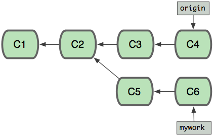
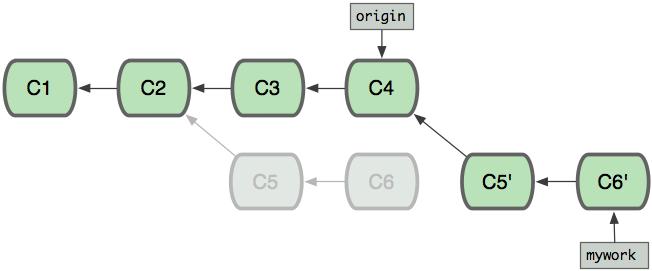

# Finding with Git Grep

Finding files with words or phrases in Git is really easy with the
[git grep](https://git-scm.com/docs/git-grep) command. It is possible to do this
with the normal unix 'grep' command, but with 'git grep' you can also search
through previous versions of the project without having to check them out.

For example, if I wanted to see every place that with 'figure' links in this
git repository, I could run this:

    $ git grep 'figure/'
    text/02_Git_Object_Model.md:
    text/02_Git_Object_Model.md:
    text/02_Git_Object_Model.md:
    text/02_Git_Object_Model.md:
    text/02_Git_Object_Model.md:
    text/13_Rebasing.md:
    text/13_Rebasing.md:
    text/13_Rebasing.md:
    text/13_Rebasing.md:
    text/13_Rebasing.md:
    text/13_Rebasing.md:

If I wanted to see the line number of each match as well, I can add the '-n'
option:

    $ git grep -n 'figure/object'
    text/02_Git_Object_Model.md:61:
    text/02_Git_Object_Model.md:88:
    text/02_Git_Object_Model.md:129:
    text/02_Git_Object_Model.md:195:
    text/02_Git_Object_Model.md:204:

If we're only interested in the filename, we can pass the '--name-only' option:

    $ git grep --name-only 'figure/'
    text/02_Git_Object_Model.md
    text/13_Rebasing.md

We could also see how many line matches we have in each file with the '-c'
option:

    $ git grep -c 'figure/'
    text/02_Git_Object_Model.md:5
    text/13_Rebasing.md:6

Now, if I wanted to see where figures were used in a specific version of the
repository, I could add a commit or tag reference to the end, like this:

    $ git grep 'figure/' 929f810
    929f810:script/html.rb:  html.gsub! /\[fig:(.*?)\]/, '

'
    929f810:text/02_Git_Object_Db_Basics/1_Trees_and_Blobs.markdown:

We can see that there are only a few lines with figure links in commit 929f810,
which was just a markdown image test.

## Advanced Search

We can also combine search terms in grep. Say we wanted to search for where
SORT_DIRENT is defined in a repository:

    $ git grep -e '#define' --and -e SORT_DIRENT
    builtin-fsck.c:#define SORT_DIRENT 0
    builtin-fsck.c:#define SORT_DIRENT 1

We can also search for every file that has *both* search terms, but display
each line that has *either* of the terms in those files:

    $ git grep --all-match -e '#define' -e SORT_DIRENT
    builtin-fsck.c:#define REACHABLE 0x0001
    builtin-fsck.c:#define SEEN      0x0002
    builtin-fsck.c:#define ERROR_OBJECT 01
    builtin-fsck.c:#define ERROR_REACHABLE 02
    builtin-fsck.c:#define SORT_DIRENT 0
    builtin-fsck.c:#define DIRENT_SORT_HINT(de) 0
    builtin-fsck.c:#define SORT_DIRENT 1
    builtin-fsck.c:#define DIRENT_SORT_HINT(de) ((de)->d_ino)
    builtin-fsck.c:#define MAX_SHA1_ENTRIES (1024)
    builtin-fsck.c: if (SORT_DIRENT)

We can also search for lines that have one term and either of two other terms,
for example, if we wanted to see where we defined constants that had either
PATH or MAX in the name:

    $ git grep -e '#define' --and \( -e PATH -e MAX \)
    abspath.c:#define MAXDEPTH 5
    builtin-blame.c:#define MORE_THAN_ONE_PATH      (1u<<13)
    builtin-blame.c:#define MAXSG 16
    builtin-describe.c:#define MAX_TAGS     (FLAG_BITS - 1)
    builtin-fetch-pack.c:#define MAX_IN_VAIN 256
    builtin-fsck.c:#define MAX_SHA1_ENTRIES (1024)
    ...
